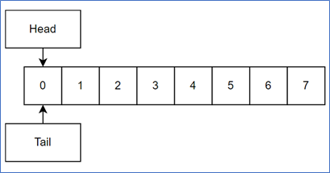
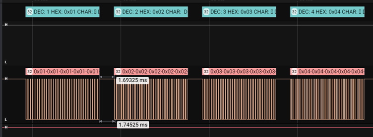
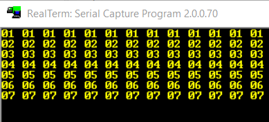

<div id="top"></div>

<!-- PROJECT SHIELDS -->
<!--
*** I'm using markdown "reference style" links for readability.
*** Reference links are enclosed in brackets [ ] instead of parentheses ( ).
*** See the bottom of this document for the declaration of the reference variables
*** for contributors-url, forks-url, etc. This is an optional, concise syntax you may use.
*** https://www.markdownguide.org/basic-syntax/#reference-style-links
-->

[![Instagram][instagram-shield]][instagram-url]
[![LinkedIn][linkedin-shield]][linkedin-url]
[![Github][github-shield]][github-url]  

<!-- PROJECT LOGO -->
<br />
<div align="center">
  <h3 align="center">UART-DMA-FIFO</h3>

  <p align="center">
    UART DMA FIFO Project for NUCLEO-F429ZI 
    <br />
    <a href="https://github.com/arslanalperen/UART-DMA-FIFO"><strong>Explore the docs »</strong></a>
    <br />
    <br />
    <a href="https://github.com/arslanalperen/UART-DMA-FIFO">View Demo</a>
    ·
    <a href="https://github.com/arslanalperen/UART-DMA-FIFO/issues">Report Bug</a>
    ·
    <a href="https://github.com/arslanalperen/UART-DMA-FIFO/issues">Request Feature</a>
  </p>
</div>

<!-- TABLE OF CONTENTS -->
<details>
  <summary>Table of Contents</summary>
  <ol>
    <li>
      <a href="#fifo-struct-variables">FIFO Struct Variables</a>
    </li>
    <li>
      <a href="#fifo-functions">FIFO Functions</a>
      <ul>
        <li><a href="#fifo-init">fifo init</a></li>
        <li><a href="#fifo-init-control">fifo_init_control</a></li>
        <li><a href="#fifo-read">fifo_read</a></li>
        <li><a href="#fifo-write">fifo_write</a></li>
        <li><a href="#uart-fifo-write">UART_fifo_write</a></li>
      </ul>
    </li>
    <li>
      <a href="#fifo-functions-detailed">FIFO Functions Detailed</a>
      <ul>
        <li><a href="#variables">Variables</a></li>
        <li><a href="#fifo-init-detailed">fifo init Detailed</a></li>
        <li><a href="#fifo-init-control-detailed">fifo init control Detailed</a></li>
        <li><a href="#fifo-read-detailed">fifo read Detailed</a></li>
        <li><a href="#fifo-write-detailed">fifo write Detailed</a></li>
        <li><a href="#uart-fifo-write-detailed">UART fifo write Detailed</a></li>
        <li><a href="#timer">Timer</a></li>
        <li><a href="#dma-tx-complete-callback">DMA TX Complete Callback</a></li>
        <li><a href="#main-code">Main Code</a></li>
      </ul>
    </li>
    <li><a href="#review">Review</a></li>
  </ol>
</details>

All the functions include at `fifo.c` and `fifo.h`.

```sh
//fifo.h file
  
#ifndef FIFO_H_
#define FIFO_H_
  
#include "main.h"
  
#define BUF_SIZE 10 //FIFO Number
#define DATA_SIZE 32 //Data Size
  
//FIFO Struct
typedef struct {
  uint8_t buf[DATA_SIZE*BUF_SIZE]; //FIFO Buffer
  unsigned short head; //FIFO Write Index
  unsigned short tail; //FIFO Read Index
  unsigned short size; //FIFO Size (Byte)
  unsigned short FIFOindex; //FIFO Buffer's Write Index
  unsigned short UARTindex; //FIFO Buffer's Read  Index
}FIFO;
  
void fifo_init();
void fifo_init_control();
unsigned short fifo_read(uint8_t * buf);
unsigned short fifo_write(uint8_t * buf);
unsigned short UART_fifo_write(UART_HandleTypeDef *huart);

#endif //FIFO_H_
```

All the functions are shown above.

## FIFO Struct Variables

The `BUF_SIZE` definition specifies how many `DATA_SIZE` size data the FIFO buffer will store. The `DATA_SIZE` definition specifies the size of the data to be stored.

FIFO variables are gathered under a struct. The `buf` variable is directly the FIFO buffer itself. The reason why it is defined as Uint8_t type is to determine that the data to be sent will be of this type.

<div align="center">  </div>

The diagram at above shows the FIFO structure. The "head" variable specifies which cell of the buffer you are in when writing data to the FIFO. The “tail” variable indicates which cell it is on when reading data from FIFO. The variable “size” specifies how many bytes the FIFO is. The "FIFOindex" variable shows how many 32 bytes of data are in the sequence when writing data to FIFO. The "UARTindex" variable shows how many 32 bytes of data are in the sequence when writing data from FIFO to UART. 10 data packets are filled into FIFO in a row as shown in diagram above.

<p align="right">(<a href="#top">back to top</a>)</p>

## FIFO Functions
### fifo init

The "fifo_init" function init the FIFO by assigning the variables of the FIFO inside the functions, if the code is run for the first time. It does not need to be called in the main code.

<p align="right">(<a href="#top">back to top</a>)</p>

### fifo init control

The "fifo_init_control" function is the function that checks whether FIFO has been inited before among other functions. It does not need to be called in the main code.

<p align="right">(<a href="#top">back to top</a>)</p>

### fifo read

The "fifo_read" function is the function that reads the data from FIFO. It reads "DATA_SIZE" size data from FIFO each time it is called. If only writing is to be done over UART, it does not need to be called in the main code.

<p align="right">(<a href="#top">back to top</a>)</p>

### fifo write

The "fifo_write" function is the one that writes data to FIFO. Each time it is called, it writes the given data to the FIFO by "DATA_SIZE". If the given data is smaller than "DATA_SIZE", it fills the remaining bytes with 0. If it is a larger data, it only writes as much as "DATA_SIZE". It can be called in the main code where data needs to be written to FIFO.

<p align="right">(<a href="#top">back to top</a>)</p>

### UART fifo write

The "UART_fifo_write" function is the function that writes the data from FIFO over UART with DMA. It can be called in the main code where the next data to be read from the FIFO should be written via DMA and UART.

In the sample project, this function is used with the timer. Therefore, there is no need to call main in the code.

<p align="right">(<a href="#top">back to top</a>)</p>

## FIFO Functions Detailed
### Variables

The "DMA_WRITE_BUF" buffer is where  the data from FIFO is transferred before transmitting to UART with DMA. Transfer is provided by giving this buffer to the DMA function.

```sh
uint8_t DMA_WRITE_BUF[DATA_SIZE]; //Buffer is filling by FIFO to write data to DMA
unsigned short fifoInit = 0; //Checking is fifo initialized
unsigned short STATUS_DMA;

//Extern this object
//Extern FIFO fifo;
//Use this object in fifo functions
FIFO fifo;
```

The "fifoInit" variable is the variable that specifies whether the FIFO is inited. In case FIFO is not inited, the "fifo_init_control" function calls the "fifo_init" function and sets the "fifoInit" variable to "1".

The “STATUS_DMA” variable stores the value returned by the DMA function after the data is written to the UART with DMA. If the returned value is "0x02U", it means DMA is busy and no new data is read from FIFO to avoid data skipping.

“FIFO fifo” is used to create an object from the defined struct. All FIFO variable operations are done on this object.

<p align="right">(<a href="#top">back to top</a>)</p>
  
### fifo init Detailed

```sh
void fifo_init(){
     fifo.head = 0;
     fifo.tail = 0;
     fifo.size = DATA_SIZE;
     fifo.buf[DATA_SIZE] = 0;
     fifo.FIFOindex = 0;
     fifo.UARTindex = 0;
}
```
It is the function that initializes the variables of FIFO.

<p align="right">(<a href="#top">back to top</a>)</p>

### fifo init control Detailed

```sh
void fifo_init_control(){
	if(fifoInit == 0){
		fifo_init();
		fifoInit = 1;
	}
}
```

The "fifo_init_control" function is the function that checks whether FIFO is inited or not among other functions.

<p align="right">(<a href="#top">back to top</a>)</p>

### fifo read Detailed 

```sh
unsigned short fifo_read(uint8_t * buf){
	unsigned short i;
    unsigned short bufIndex = 0;
    fifo_init_control();
    for(i = fifo.UARTindex*DATA_SIZE; i < (fifo.UARTindex+1)*DATA_SIZE; i++){
    	if( fifo.tail != fifo.head ){
    		buf[bufIndex] = fifo.buf[fifo.tail];
            fifo.tail++;
            bufIndex++;
            if( fifo.tail == DATA_SIZE*BUF_SIZE )
            	fifo.tail = 0;
        }
    	else
    		return i;
     }

	if(fifo.UARTindex + 1 == BUF_SIZE)
		fifo.UARTindex = 0;
//	else
//		fifo.UARTindex++;
	return DATA_SIZE;
}
```

The “i” variable is a dummy variable created for use in "for" loop. The variable "bufIndex" is used to define the current cell of the buffer, regardless of the variable "i". When reading or writing from FIFO, the "i" variable is equalized to the product of "UARTindex" and "DATA_SIZE" so that it can be made as 32 bytes of data. The cycle continues until “UARTindex+1” and “DATA_SIZE” are multiplied in order to process until the next data packet.

The expression “tail != head” means that data is writting to the FIFO. If there is equality, it means that there is no data to be read in FIFO. Therefore, in the case of "tail != head", reading from FIFO is performed. The size of the FIFO is limited by the "BUF_SIZE" variable. After the buffer is full, new data will be overwritten. So it is reset when UARTindex equals last data.

<p align="right">(<a href="#top">back to top</a>)</p>

### fifo write Detailed

```sh
unsigned short fifo_write(uint8_t * buf){
	unsigned short i;
	unsigned short bufIndex = 0;
    fifo_init_control();
	for(i = fifo.FIFOindex*DATA_SIZE; i < (fifo.FIFOindex+1)*DATA_SIZE; i++){
		if( (fifo.head + 1 == fifo.tail) || ( (fifo.head + 1 == (fifo.size)*fifo.FIFOindex) && (fifo.tail == 0) ))
			return i;
		else {
			fifo.buf[fifo.head] = buf[bufIndex];
			fifo.head++;
			bufIndex++;
			if( fifo.head == DATA_SIZE*BUF_SIZE )
				fifo.head = 0;
		}
	}
	if(fifo.FIFOindex + 1 == BUF_SIZE)
		fifo.FIFOindex = 0;
	else
		fifo.FIFOindex++;
	return DATA_SIZE;
}
```

The same applies to the "i" and "bufIndex" variables as written in the "fifo_read" function. Likewise, for loop parameters, what is written in the "fifo_read" function is valid. Unlike the "fifo_read" function, progress is made through the "head" variable. In this way, when reading, it is possible to proceed through the equality of the "head" and "tail" variables.

<p align="right">(<a href="#top">back to top</a>)</p>

### UART fifo write Detailed

```sh
unsigned short UART_fifo_write(UART_HandleTypeDef *huart){
	unsigned short STATUS_DMA = 0x00U;
	fifo_init_control();
	if((fifo.UARTindex != 0 || fifo.UARTindex != fifo.FIFOindex) && (fifo.head != fifo.tail)){
		if(STATUS_DMA == 0x02U){
			STATUS_DMA = HAL_UART_Transmit_DMA(huart,DMA_WRITE_BUF,DATA_SIZE);
		}
		else if(STATUS_DMA == 0x00U){
			fifo_read(DMA_WRITE_BUF);
			STATUS_DMA = HAL_UART_Transmit_DMA(huart,DMA_WRITE_BUF,DATA_SIZE);
		}
	}
	return STATUS_DMA;
}
```

The “STATUS_DMA” variable stores the value returned by the “HAL_UART_Transmit_DMA” function. If DMA is available to send data, it returns values such as "HAL_OK" or otherwise "HAL_BUSY". The values 0x00U for “HAL_OK” and 0x02U for “HAL_BUSY” correspond.

In the first if block, a double-sided control is made. If "head" and "tail" are not equal, there is data to be transmitted to the UART next, or there is an unsent data packet if "UARTindex" and "FIFOindex" are not equal and "UARTindex" is not 0. In this block, “STATUS_DMA” controlled. If data is to be sent for the first time, the DMA is not busy. Therefore, 0x00U value is assigned to “STATUS_DMA” variable as initial value. In other words, when the data will be transmitted to the UART for the first time, the code enters the else if block and reads data from the FIFO and takes the data to the "DMA_WRITE_BUF" buffer. Then, using the "HAL_UART_Transmit_DMA" function, it transmits the data to UART with DMA. As a return, it takes the state of the DMA and assigns it to the "STATUS_DMA" variable. If DMA is busy, the “HAL_UART_Transmit_DMA” function will return 0x02U. In this case the code goes into the first if block. In order to avoid data loss, no new data is retrieved from the FIFO and the "HAL_UART_Transmit_DMA" function is called again to find out the current status of the DMA. If the "HAL_UART_Transmit_DMA" function is available during this time, the data is transmitted by DMA. If not, this cycle is repeated until DMA is available.

<p align="right">(<a href="#top">back to top</a>)</p>

### Timer

```sh
void TIM3_IRQHandler(void)
{
  /* USER CODE BEGIN TIM3_IRQn 0 */

  /* USER CODE END TIM3_IRQn 0 */
  HAL_TIM_IRQHandler(&htim3);
  /* USER CODE BEGIN TIM3_IRQn 1 */

  HAL_GPIO_TogglePin(LD3_GPIO_Port, LD3_Pin);
  UART_fifo_write(&huart2);

  /* USER CODE END TIM3_IRQn 1 */
}
```

It works with timer. TIM3 is used in the sample code. The "UART_fifo_write" function is called within the timer function. UART2 is used in the sample code. Therefore, "&huart2" is given as a parameter to the "UART_fifo_write" function. In order to visually ensure that the code is entered into the timer, LED3 is lit within the function.

<p align="right">(<a href="#top">back to top</a>)</p>

### DMA TX Complete Callback

```sh
void HAL_UART_TxCpltCallback(UART_HandleTypeDef *huart){
	HAL_GPIO_TogglePin(LD1_GPIO_Port, LD1_Pin);
	fifo.UARTindex++;
}
```
When the data transfer over UART with DMA is completed, the code enters the “HAL_UART_TxCpltCallback” function. After making sure that the data transfer is complete, the "UARTindex" variable is increased. That's why this process is done inside the "HAL_UART_TxCpltCallback" function. LED1 is lit to visually ensure that the code is entered into the “HAL_UART_TxCpltCallback” function.

<p align="right">(<a href="#top">back to top</a>)</p>

### Main Code

In the sample project, 9 dummy data were prepared. Each data is 32bytes. In addition, the “fifo” object of “FIFO” type created in the “fifo.c” file must be exported in the main code (as it is used in the “HAL_UART_TxCpltCallback” function).

```sh
/* USER CODE BEGIN PV */

uint8_t data1[DATA_SIZE] = {0x1,0x1,0x1,0x1,0x1,0x1,0x1,0x1,0x1,0x1,0x1,0x1,0x1,0x1,0x1,0x1,0x1,0x1,0x1,0x1,0x1,0x1,0x1,0x1,0x1,0x1,0x1,0x1,0x1,0x1,0x1,0x1};
uint8_t data2[DATA_SIZE] = {0x2,0x2,0x2,0x2,0x2,0x2,0x2,0x2,0x2,0x2,0x2,0x2,0x2,0x2,0x2,0x2,0x2,0x2,0x2,0x2,0x2,0x2,0x2,0x2,0x2,0x2,0x2,0x2,0x2,0x2,0x2,0x2};
uint8_t data3[DATA_SIZE] = {0x3,0x3,0x3,0x3,0x3,0x3,0x3,0x3,0x3,0x3,0x3,0x3,0x3,0x3,0x3,0x3,0x3,0x3,0x3,0x3,0x3,0x3,0x3,0x3,0x3,0x3,0x3,0x3,0x3,0x3,0x3,0x3};
uint8_t data4[DATA_SIZE] = {0x4,0x4,0x4,0x4,0x4,0x4,0x4,0x4,0x4,0x4,0x4,0x4,0x4,0x4,0x4,0x4,0x4,0x4,0x4,0x4,0x4,0x4,0x4,0x4,0x4,0x4,0x4,0x4,0x4,0x4,0x4,0x4};
uint8_t data5[DATA_SIZE] = {0x5,0x5,0x5,0x5,0x5,0x5,0x5,0x5,0x5,0x5,0x5,0x5,0x5,0x5,0x5,0x5,0x5,0x5,0x5,0x5,0x5,0x5,0x5,0x5,0x5,0x5,0x5,0x5,0x5,0x5,0x5,0x5};
uint8_t data6[DATA_SIZE] = {0x6,0x6,0x6,0x6,0x6,0x6,0x6,0x6,0x6,0x6,0x6,0x6,0x6,0x6,0x6,0x6,0x6,0x6,0x6,0x6,0x6,0x6,0x6,0x6,0x6,0x6,0x6,0x6,0x6,0x6,0x6,0x6};
uint8_t data7[DATA_SIZE] = {0x7,0x7,0x7,0x7,0x7,0x7,0x7,0x7,0x7,0x7,0x7,0x7,0x7,0x7,0x7,0x7,0x7,0x7,0x7,0x7,0x7,0x7,0x7,0x7,0x7,0x7,0x7,0x7,0x7,0x7,0x7,0x7};
uint8_t data8[DATA_SIZE] = {0x8,0x8,0x8,0x8,0x8,0x8,0x8,0x8,0x8,0x8,0x8,0x8,0x8,0x8,0x8,0x8,0x8,0x8,0x8,0x8,0x8,0x8,0x8,0x8,0x8,0x8,0x8,0x8,0x8,0x8,0x8,0x8};
uint8_t data9[DATA_SIZE] = {0x9,0x9,0x9,0x9,0x9,0x9,0x9,0x9,0x9,0x9,0x9,0x9,0x9,0x9,0x9,0x9,0x9,0x9,0x9,0x9,0x9,0x9,0x9,0x9,0x9,0x9,0x9,0x9,0x9,0x9,0x9,0x9};

extern FIFO fifo;

/* USER CODE END PV */
```
In the while loop at the main code, the data is written to FIFO at 2 millisecond intervals. Something like this was made to test the code. LED2 is lit in order to visually understand that the code is rotating in the while.

While the code writes the data to FIFO at intervals of 2 milliseconds in the while loop at the main code, the timer runs at intervals of about 1 millisecond. By entering the timer function every 1 millisecond, it is checked whether there is data to be written to the UART via DMA. The timer duration was also tested in 10 milliseconds and the code still worked properly.

```sh
  while (1)
  {
	  HAL_GPIO_TogglePin(LD2_GPIO_Port, LD2_Pin);

	  fifo_write(data1);
	  HAL_Delay(2);
	  fifo_write(data2);
	  HAL_Delay(2);
	  fifo_write(data3);
	  HAL_Delay(2);
	  fifo_write(data4);
	  HAL_Delay(2);
	  fifo_write(data5);
	  HAL_Delay(2);
	  fifo_write(data6);
	  HAL_Delay(2);
	  fifo_write(data7);
	  HAL_Delay(2);
	  fifo_write(data8);
	  HAL_Delay(2);
	  fifo_write(data9);

    /* USER CODE END WHILE */

    /* USER CODE BEGIN 3 */
  }
  /* USER CODE END 3 */
}
```

## Review

Even though the code seems to work correctly several times, the code does NOT work properly.

<div align="center">  </div>

The data was printed to the UART in the order it was sent in the code. The timer duration is set to approximately 1 ms. It can be seen that the distance between data transfer is close to 1ms.

<div align="center">  </div>

As can be seen at above, the data was printed to the UART as it was sent.

<p align="right">(<a href="#top">back to top</a>)</p>

<!-- MARKDOWN LINKS & IMAGES -->
<!-- https://www.markdownguide.org/basic-syntax/#reference-style-links -->

[instagram-shield]: https://img.shields.io/badge/Instagram-E4405F?style=for-the-badge&logo=instagram&logoColor=white
[github-shield]: https://img.shields.io/badge/GitHub-100000?style=for-the-badge&logo=github&logoColor=white
[linkedin-shield]: https://img.shields.io/badge/LinkedIn-0077B5?style=for-the-badge&logo=linkedin&logoColor=white

[instagram-url]: https://www.instagram.com/arslanalperen55/
[github-url]: https://github.com/arslanalperen
[linkedin-url]: https://www.linkedin.com/in/arslanalperen/

[fifo-diagram]: Images/fifo-diagram.png
